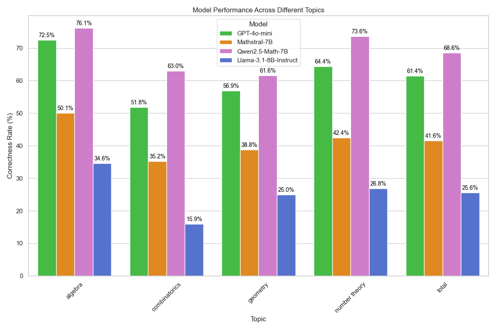

# Comparison of Problem-solving Performance Across Mathematical Domains With Large Language Models

[](https://doi.org/10.15407/jai2024.04.096)
[](https://huggingface.co/datasets/andynik/numina-cot-2kx4)
[](https://github.com/andynik/math-domains-comp-24)

This repository contains the code and data used for a research experiment that compares LLM performances across mathematical domains. The findings contribute to understanding the capabilities and limitations of these models in solving complex mathematical problems.

The Combi-Puzzles dataset is available in `JSON format` and in `Parquet format` on the [Hugging Face](https://huggingface.co/datasets/andynik/numina-cot-2kx4) repository.

## Project Stages

- **Stage 1: Filtering** 
  - Filtering 8,000 problems from [NuminaMath-TIR](https://huggingface.co/datasets/AI-MO/NuminaMath-TIR), with 2,000 problems per topic: algebra, geometry, combinatorics and number theory.
  
- **Stage 2: Model Inference**
  - Apply the models listed below to the selected problems.

- **Stage 3: Answer Extraction**
  - Use regex to extract answers produced by each model.

- **Stage 4: Results Comparison**
  - Permutation test and Chi-test to compare the results.

## Models Used in the Experiment

The open-source models have been quantised using K-means quantisation with the help of [llama.cpp](https://github.com/ggerganov/llama.cpp) library.

| Model                                                                                 | Params | Is quant. | Q. method | Context length | Knowledge cutoff | Model creator  |
|---------------------------------------------------------------------------------------|--------|-----------|-----------|----------------|------------------|----------------|
| [GPT-4o-mini-2024-07-18](https://platform.openai.com/docs/models/gpt-4o-mini)         | n/a    | ✘         | -         | 128k           | Oct 2023         | OpenAI         |
| [Mathstral-7B](https://huggingface.co/QuantFactory/mathstral-7B-v0.1-GGUF)            | 7.25B  | ✔         | Q4_K_M    | 32k            | n/a              | Mistral AI     |
| [Qwen2.5-Math-7B](https://huggingface.co/QuantFactory/Qwen2.5-Math-7B-GGUF)           | 7.62B  | ✔         | Q4_K_M    | 128k           | n/a              | Alibaba Cloud  |
| [Llama-3.1-8B-Instruct](https://huggingface.co/QuantFactory/Meta-Llama-3.1-8B-Instruct-GGUF) | 8.03B  | ✔         | Q4_K_M    | 128k           | Dec 2023         | Meta           |

## Results



## Usage

You are encouraged to use this dataset to further evaluate problem-solving strategies in LLMs or other domains. Please cite our paper if you publish material based on this dataset.

## License

This dataset is licensed under the MIT License. See the `LICENSE` file for more details.

## Citation

Please cite the following if you use the dataset in your work:

```bibtex
@article{nikolaiev2024comparison,
  title={Comparison of Problem-solving Performance Across Mathematical Domains With Large Language Models},
  author={Nikolaiev, Andrii D. and Derevianchenko, Oleksandr V.},
  journal={Shtuchnyy intelekt},
  year={2024},
  pages={96--104},
  doi={10.15407/jai2024.04.096}
}
```
